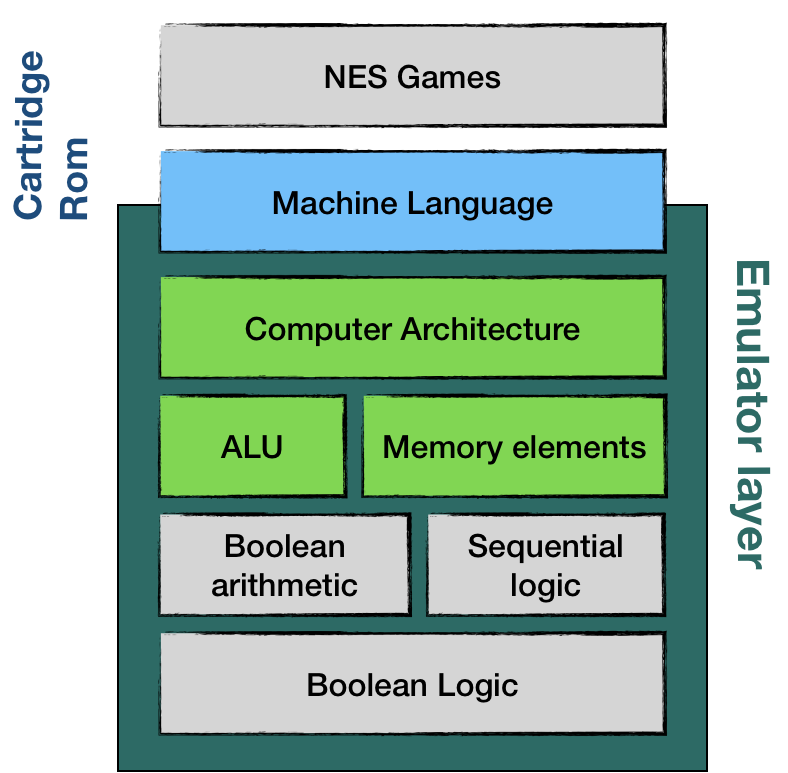
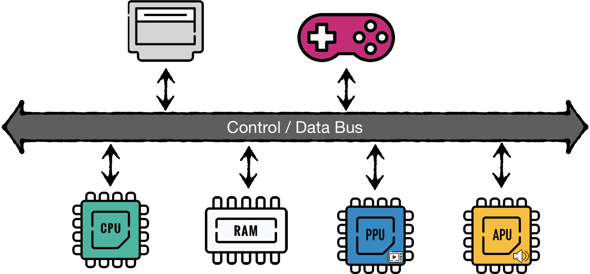
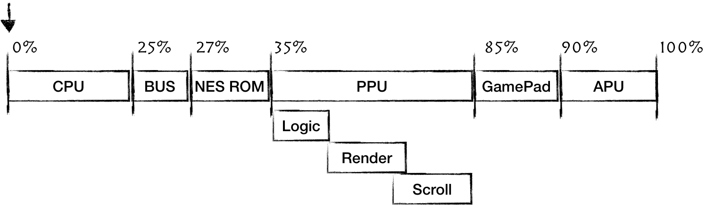
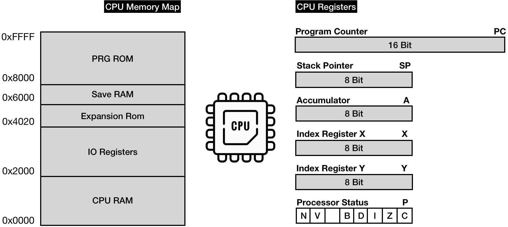

The NES is a distributed system consisting of a CPU, PPU, RAM, and APU. It also
interfaces with game cartridges and gamepads.

CPU Memory Map and Registers:

## File Structure

The project is organized as follows:

- `src/`: Contains the source code for the emulator.
  - `cpu.rs`: Implementation of the NES CPU.
  - `ppu.rs`: Implementation of the Picture Processing Unit.
  - `apu.rs`: Implementation of the Audio Processing Unit.
  - `memory.rs`: Memory management and mapping.
  - `main.rs`: Entry point of the emulator.
- `tests/`: Contains unit and integration tests.
- `assets/`: Stores resources like ROM files and test data.
- `readme.md`: Documentation for the project.
- `Cargo.toml`: Rust project configuration file.
- `Cargo.lock`: Dependency lock file.

## Resources

- https://bugzmanov.github.io/nes_ebook/chapter_3_1.html
- https://www.nesdev.org/obelisk-6502-guide/reference.html#INX
